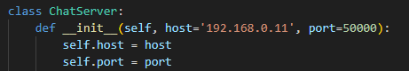

README - Chat Multiusuario con Sockets e Interfáz Gráfica

    DESCRIPCIÓN
Chat en tiempo real para red local (LAN) con estructura cliente-servidor con base sockets.  
El servidor gestiona múltiples conexiones concurrentes mediante hilos.  
El cliente tiene una interfaz gráfica para un mejor aspecto del chat.

    ESTRUCTURA DE ARCHIVOS
1. `server.py`  
   - Clase `ChatServer` que contiene toda la lógica del servidor.   
   - Cada cliente nuevo que se conecte al servido tendrá su propio hilo.  
   - El Método `broadcast()` envía el mensaje a todos excepto al emisor (para evitar eco de mensajes).  
   - Detecta y elimina automáticamente clientes desconectados.  
   - Puerto por defecto: 50000 (configurable dentro del código).

2. `client.py`  
   - Clase `ChatGUI` que contiene toda la interfaz y lógica del cliente.  
   - Conexión automática al servidor cuando se inicia la aplicación. (opcional y configurable dentro del código)  
   - Hilo dedicado específicamente para recepción de mensajes (no bloquea la interfaz).  
   - Eco local: los mensajes propios se muestran inmediatamente en verde sin esperar respuesta del servidor.  

   - Colores de chat:  
     - Mensajes propios → verde ("#00ff9d")  
     - Mensajes de otro usuario → blanco ("white") 
     - Mensajes del sistema → naranja ("#ff9f1c")  
     - Errores → rojo  ("red")

   - Botones:  
     - Enviar (azul)  
     - Desconectar (rojo)  

   - Despues de desconectarse, se desabilita la caja de mensajes  
   - Confirmación al cerrar la ventana con `messagebox.askokcancel`.  
   - Cierre limpio del socket al desconectarse.

    CARACTERÍSTICAS TÉCNICAS
- Uso exclusivo de la biblioteca estándar de Python (sin dependencias externas).  
- Totalmente multiplataforma (Windows, Linux, macOS).  
- Diseño simple y moderno con ventana de tamaño fijo.  
- Scroll automático al último mensaje recibido.

    REQUISITOS
- Python 3.6 o superior.  
- No requiere instalación de paquetes adicionales (ya que todas las librerias usadas vienen por defecto con python).

    CONFIGURACIÓN DE USO
1. Abra cmd en su dispositivo e ingrese el comando "ipconfig", busque la linea de IPv4, copie y pegue en el siguiente espacio del código "client.py" y "server.py": 
    CLIENTE



    SERVIDOR


(Asegurese de que la IP y el Puerto sean el mismo, usa un puerto libre, ejemplo: "20000","23456","55555")

1. Ejecutar el cliente ():
    Cree una terminal y copie el siguiente comando (asegurese de tener el mismo nombre del archivo="client.py"):
   ```python
   python client.py
   ```

3. Para conectarse al chat desde otro dispositivo (Bidireccional):
El dispositivo Tiene que estar conectado al mismo router que el del servidor (No afecta con conexiones 5G):

   Modificar en `client.py`:  

   ```python
   self.HOST = '192.168.1.xx'   # IP local del dispositivo que ejecuta el servidor
   ```
(Copie y pegue exclusivamente en el archivo de "client.py")

    COMANDOS 
- Escribir cualquier texto y pulsar Enter o el botón Enviar.  
- `/salir` → cierra la conexión al servidor (pero no se cierra el programa).  
- Botón Desconectar → misma función que `/salir`.

    EXPLICACIÓN CÓDIGO
```python
    self.entrada = tk.Entry(frame_inf, width=42, font=("Segoe UI", 11), # Imput de texto para envio de mensajes
                                bg="#2d3436", fg="white", insertbackground="white")
    self.entrada.pack(side=tk.LEFT, padx=5)
    self.entrada.bind("<Return>", self.enviar_mensaje)
    self.entrada.focus()
```

```python
# Cliente - Eco (Muestra tu propio mensaje)
    self.mostrar_mensaje(f"Tú: {mensaje}\n", "propio") 
```

```python
    def conectar_al_servidor(self):
        try:
            self.socket = socket.socket(socket.AF_INET, socket.SOCK_STREAM) # Iteración del socket
            self.socket.connect((self.HOST, self.PORT))
            self.conectado = True
            self.mostrar_mensaje("Conectado al servidor correctamente.\n", "sistema")

            hilo = threading.Thread(target=self.recibir_mensajes, daemon=True) # Iteración de hilo por usuario, para recibir mensajes
            hilo.start()
        except Exception as e:
            messagebox.showerror("Error de conexión", f"No se pudo conectar al servidor:\n{e}")
            self.window.destroy() # Elimina la ventana si no se puede conectar
```
```python
    def recibir_mensajes(self):
        while self.conectado:
            try:
                mensaje = self.socket.recv(1024).decode('utf-8') 
                if mensaje:
                   
                    self.mostrar_mensaje(mensaje, "otros") # Muestra mensajes recibidos de otros usuarios
```


    Notas finales
- Pueden crearse la cantidad de clientes que desee en un mismo dispositivo (Recomendado máximo 6 usuarios) 
- El puerto debe estar libre y no bloqueado por firewall (Dar permisos)  
- Ideal para uso educativo, pruebas locales o redes internas (Empleados en un mismo edificio)
- Despues de que se desconecte, perderá toda la información (Ideal para información efímera)
